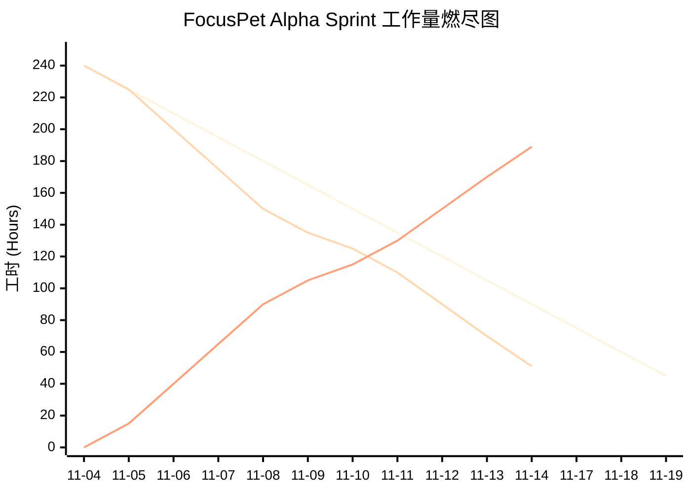

# 🗓️ Daily Scrum Report: FocusPet Alpha 

项目地址 [https://github.com/YigesMx/pet-focus](https://github.com/YigesMx/pet-focus)

## 📊 工作进度总览

| 日期 | 团队成员 | 任务 | 最初计划(h) | 已花费(h) | 剩余(h) | 状态 |
|------|---------|------|-----------|----------|--------|------|
| **11-04** | 毛一戈 | 数据库初始化脚本 + Command列表定义 | 6 | 6 | 0 | ✅ |
| **11-04** | 赵昱 | 番茄钟后端核心服务(TimerService) | 6 | 6 | 0 | ✅ |
| **11-04** | 李永康 | 研究Godot与Tauri通信 + 建立项目仓库 | 3 | 3 | 0 | ✅ |
| **11-04** | 申鹏 | 前端脚手架 + Shadcn UI + 主界面布局 | 6 | 6 | 0 | ✅ |
| **11-05** | 毛一戈 | 初始化Tauri后端 + 后端模块划分 | 6 | 6 | 0 | ✅ |
| **11-05** | 赵昱 | Sprint规划会 + Tauri前端骨架 | 6 | 6 | 0 | ✅ |
| **11-05** | 李永康 | 建立Godot项目仓库 + 配置开发环境 | 5 | 5 | 0 | ✅ |
| **11-05** | 申鹏 | 前端开发环境 + React项目骨架 | 4 | 4 | 0 | ✅ |
| **11-06** | 毛一戈 | Todo增删改查逻辑 + WebSocket服务器雏形 | 10 | 10 | 0 | ✅ |
| **11-06** | 赵昱 | 计时器倒计时逻辑 + 系统通知代码 | 8 | 8 | 0 | ✅ |
| **11-06** | 李永康 | Godot WebSocket连接脚本 + 宠物素材导入 | 6 | 6 | 0 | ✅ |
| **11-06** | 申鹏 | 侧边栏导航 + 专注页面高保真还原 | 8 | 8 | 0 | ✅ |
| **11-07** | 毛一戈 | 系统托盘功能 + 窗口置顶/穿透接口 | 8 | 8 | 0 | ✅ |
| **11-07** | 赵昱 | 系统通知与番茄钟绑定 + 统计DB Schema | 6 | 6 | 0 | ✅ |
| **11-07** | 李永康 | WebSocket联调 + 宠物动画状态机脚本 | 6 | 6 | 0 | ✅ |
| **11-07** | 申鹏 | 专注页面交互逻辑 + 设置页面基础UI | 5 | 5 | 0 | ✅ |
| **11-08** | 毛一戈 | （周末）系统托盘全平台适配 + 窗口管理逻辑 | 6 | 6 | 0 | ✅ |
| **11-08** | 赵昱 | （周末）统计功能数据库表结构搭建 | 4 | 4 | 0 | ✅ |
| **11-08** | 李永康 | （周末）Godot WebSocket连接成功 | 3 | 3 | 0 | ✅ |
| **11-08** | 申鹏 | （周末）设置页面UI开发 | 2 | 2 | 0 | ✅ |
| **11-09** | 毛一戈 | （周末）系统托盘右键菜单完善 | - | 0 | 0 | 🔄 |
| **11-09** | 赵昱 | （周末）审查UI代码 + 合并主分支 | - | 1 | 0 | ✅ |
| **11-09** | 李永康 | （周末）宠物待机和行走动画状态机 | 4 | 4 | 0 | ✅ |
| **11-09** | 申鹏 | （周末）深色/浅色模式主题切换 | 5 | 5 | 0 | ✅ |
| **11-10** | 毛一戈 | WebSocket消息广播 + request库研究 | 6 | 6 | 0 | ✅ |
| **11-10** | 赵昱 | 专注结束数据记录 + 消息格式确认 | 4 | 4 | 0 | ✅ |
| **11-10** | 李永康 | 宠物动画绑定 + 透明窗口锯齿问题 | 6 | 6 | 0 | ✅ |
| **11-10** | 申鹏 | 统计页面UI骨架 + 番茄钟倒计时调试 | 6 | 6 | 0 | ✅ |
| **11-11** | 毛一戈 | CalDAV基础同步 + WebSocket字段调试 | 10 | 6 | 4 | ⚠️ 想得太简单 |
| **11-11** | 赵昱 | 统计API封装 + 系统通知声音提示 | 6 | 6 | 0 | ✅ |
| **11-11** | 李永康 | WebSocket重连优化 + 鼠标交互反馈 | 5 | 5 | 0 | ✅ |
| **11-11** | 申鹏 | 对接统计API + Todo排序接口 | 6 | 5 | 1 | ⚠️ 图表闪烁问题 |
| **11-12** | 毛一戈 | DB Vacuum优化 + Todo单元测试 | 6 | 6 | 0 | ✅ |
| **11-12** | 赵昱 | 代码合并 + 番茄钟压力测试 | 5 | 5 | 0 | ✅ |
| **11-12** | 李永康 | 清理未使用资源 + 动画速度微调 | 5 | 5 | 0 | ✅ |
| **11-12** | 申鹏 | 暗色模式bug修复 + UI走查 | 4 | 4 | 0 | ✅ |
| **11-13** | 毛一戈 | 打包脚本(Win/macOS) + race condition修复 | 8 | 5 | 5 | ⚠️ 打包复杂 |
| **11-13** | 赵昱 | 内部演示运行 + code signing证书跟进 | 5 | 5 | 0 | ✅ |
| **11-13** | 李永康 | 清理未使用资源 + 动画速度微调 | 5 | 5 | 0 | ✅ |
| **11-13** | 申鹏 | 统计图表暗色模式修复 + NPS弹窗草案 | 5 | 5 | 0 | ✅ |
| **11-14** | 毛一戈 | 继续完成打包脚本 + 证书配置 | 5 | 3 | 3 | 🔄 进行中 |
| **11-14** | 赵昱 | Pull Request规范 + CI Actions初始化 | 4 | 4 | 0 | ✅ |
| **11-14** | 李永康 | 研究Godot C++ Extension + 编译环境搭建 | 6 | 4 | 4 | ⚠️ 编译环境复杂 |
| **11-14** | 申鹏 | UI最终优化 + 文档整理 | 3 | 2 | 1 | 🔄 进行中 |

## 📈 每日工作量变化统计

**Scrum Master:** 赵昱 
**Sprint 阶段:** Alpha 开发冲刺最后阶段
**团队成员:** 赵昱, 毛一戈, 李永康, 申鹏

-----

### 📅 2025年11月14日 (星期五)

**状态:** Alpha版本最终冲刺与发布准备

#### 1\. 昨天做了什么 (Yesterday)

  * **毛一戈:**
      * 开始准备 Windows/macOS 的打包脚本（Tauri + Inno/DMG），完成了基础框架。
      * 修复了集成测试中发现的一个 race condition。
  * **赵昱 (SM):**
      * 运行了一次完整的内部演示，记录了反馈并整理了行动项。
      * 跟进了 code signing 证书信息，列出了缺失项清单。
  * **李永康:**
      * 为了隐藏桌面宠物在 taskbar 上的图标，开始研究和使用 Godot 的 C++ Extension 功能。
      * 为编译 C++ Extension Plugin 搭建编译环境，花费了较多时间但尚未完成配置。
  * **申鹏:**
      * 将 NPS 弹窗接入了后端统计事件（埋点）。
      * 修复了暗色模式下的对比度问题并准备了 UI 走查清单。

#### 2\. 今天计划做什么 (Today)

  * **毛一戈:**
      * 继续完善打包脚本，解决证书配置问题。
      * 进行打包测试，确保在不同平台上都能正常运行。
  * **赵昱 (SM):**
      * 进行 Alpha 版本的最终测试，验证所有核心功能。
      * 完成 Pull Request 和 CI Actions 的初始化配置。
  * **李永康:**
      * 继续努力搭建 C++ Extension 的编译环境。
      * 解决编译环境配置中遇到的技术问题。
  * **申鹏:**
      * 进行最后的 UI 优化和调整。
      * 整理前端代码文档和注释。

#### 3\. 遇到的障碍 (Blockers)

  * **打包配置：** 打包脚本的证书配置比预期复杂，需要额外时间调试。
  * **跨平台测试：** 缺少 macOS 测试设备，需要协调资源。

-----

### 📅 2025年11月13日 (星期四)

**状态:** 内部演示准备、打包与集成验证

#### 1\. 昨天做了什么 (Yesterday)

  * **毛一戈:**
      * 与李永康一起回归并修复了 WebSocket 在高频消息下的内存泄漏。
      * 编写了集成测试脚本，覆盖了 focus_start/focus_end/ todo_complete 流程。
  * **赵昱 (SM):**
      * 组织了内部演示流程，准备演示脚本与记录要点。
      * 汇总了本周的关键 bug 列表并分配优先级。
  * **李永康:**
      * 清理 Godot 项目中未使用的资源，减小打包体积。
      * 微调宠物动画播放速度。
  * **申鹏:**
      * 修复统计图表在暗色模式下的显示 bug。
      * 完成了 NPS 弹窗的前端样式与交互草案。

#### 2\. 今天计划做什么 (Today)

  * **毛一戈:**
      * 开始准备 Windows/macOS 的打包脚本（Tauri + Inno/DMG）。
      * 修复集成测试中发现的一个 race condition。
  * **赵昱 (SM):**
      * 运行一次完整的内部演示，记录大家的反馈并整理行动项。
      * 跟进打包所需的 code signing 证书信息（列出缺失项）。
  * **李永康:**
      * 研究 Godot C++ Extension，为隐藏桌面宠物在 taskbar 上的图标做准备（原生 Godot 不支持此功能）。
      * 搭建 C++ Extension Plugin 的编译环境。
  * **申鹏:**
      * 将 NPS 弹窗接入后端统计事件（埋点）。
      * 修复暗色模式下少量对比度问题并准备 UI 走查清单。

#### 3\. 遇到的障碍 (Blockers)

  * **打包与签名：** Windows installer 的 code signing 证书尚未准备，可能影响 Beta 打包速度。
  * **小平台兼容：** 部分老旧显卡在透明窗口下仍有微小边缘问题，需后续跟进。
  * **测试时间：** 完整的端到端集成测试需要一次无干扰的 30-60 分钟窗口，安排上有冲突。

-----

### 📅 2025年11月12日 (星期三)

**状态:** 冲刺收尾、集成测试与 Bug 修复

#### 1\. 昨天做了什么 (Yesterday)

  * **毛一戈:**
      * 完成了 Todo 列表的 CalDAV 双向同步逻辑，解决了与 Nextcloud 服务器的时间戳冲突问题。
      * 协助申鹏修复了前端调用 `get_todos` 命令时的异步死锁 bug。
  * **赵昱 (SM):**
      * 完成了统计功能 (`Stats Service`) 的后端 API，支持查询“今日专注时长”和“最近7天趋势”。
      * 修复了系统通知在 Windows 11 下不弹出的 Bug（权限配置问题）。
  * **李永康:**
      * 优化了 Godot 端的 WebSocket 心跳机制，解决了后台运行断连问题。
      * 添加了宠物“摸头”反馈交互。
  * **申鹏:**
      * 完成了统计页面的前端对接，渲染了专注数据图表。
      * 对整体 UI 进行了“像素级”调整，统一了边距和字体颜色。

#### 2\. 今天计划做什么 (Today)

  * **毛一戈:**
      * 对数据库进行 Vacuum 优化，减小 SQLite 文件体积。
      * 编写 Todo 模块的单元测试，确保边界情况（如空标题、超长备注）不崩坏。
  * **赵昱 (SM):**
      * 作为 SM，主持代码合并，准备 Alpha 内部演示版本。
      * 对番茄钟计时的准确性进行压力测试。
  * **李永康:**
      * 清理 Godot 项目中未使用的资源，减小打包体积。
      * 微调宠物动画播放速度。
  * **申鹏:**
      * 修复统计图表在暗色模式下的显示 bug。
      * 协助 赵昱 (SM) 进行 UI 走查。

#### 3\. 遇到的障碍 (Blockers)

  * **无**。准备进行内部集成测试。

-----

### 📅 2025年11月11日 (星期二)

**状态:** 统计功能、Todo同步与 UI 深度集成

#### 1\. 昨天做了什么 (Yesterday)

  * **毛一戈:**
      * 重构了后端 WebSocket 服务器 (`WebSocketServer`) 的消息路由，支持了更复杂的 JSON 负载。
      * 实现了“系统设置”的持久化存储（保存用户偏好到 SQLite）。
  * **赵昱 (SM):**
      * 实现了番茄钟结束后的数据落库逻辑（SQLite `focus_sessions` 表）。
      * 编写了统计模块的 SQL 聚合查询语句。
  * **李永康:**
      * 实现了宠物根据“专注状态”自动切换动画（专注时戴眼镜，休息时玩球）。
      * 联调通过：成功接收到毛一戈发出的 WebSocket 消息。
  * **申鹏:**
      * 完成了“统计页面”的静态布局。
      * 完成了 Todo 列表的拖拽排序 UI。

#### 2\. 今天计划做什么 (Today)

  * **毛一戈:**
      * 实现 CalDAV 的基础同步功能（先做单向拉取）。
      * 配合李永康调试 WebSocket 消息的具体字段定义。
  * **赵昱 (SM):**
      * 封装统计数据的 API 供前端调用。
      * 调试系统通知的声音提示功能。
  * **李永康:**
      * 优化 WebSocket 断线重连的体验。
      * 尝试添加简单的鼠标点击交互反馈。
  * **申鹏:**
      * 对接后端的统计 API。
      * 对接毛一戈的 Todo 排序接口。

#### 3\. 遇到的障碍 (Blockers)

  * **申鹏:** 统计图表库在 Tauri Webview 中首次加载有闪烁，需要排查 CSS 兼容性。

-----

### 📅 2025年11月10日 (星期一)

**状态:** 周末进度同步与 WebSocket 联调

#### 1\. 昨天做了什么 (Yesterday - Weekend)

  * **毛一戈:**
      * (周末) 完成了系统托盘 (`System Tray`) 的全平台适配（Win/Mac），支持托盘右键菜单退出。
      * (周末) 实现了窗口管理逻辑：点击托盘图标显示/隐藏主窗口。
  * **赵昱 (SM):**
      * (周末) 搭建了统计功能的数据库表结构。
      * (周末) 审查了申鹏提交的 UI 代码，合并了主分支。
  * **李永康:**
      * (周末) Godot 客户端成功连接到了毛一戈搭建的 WebSocket 服务。
      * (周末) 完成了宠物的基础“待机”和“行走”动画状态机。
  * **申鹏:**
      * (周末) 完成了设置页面的 UI 开发。
      * (周末) 实现了深色模式/浅色模式的主题切换逻辑。

#### 2\. 今天计划做什么 (Today)

  * **毛一戈:**
      * 完善 WebSocket 服务器的消息广播机制（当 Todo 完成时，广播消息给 Godot）。
      * 开始研究 `reqwest` 库，为 CalDAV 做准备。
  * **赵昱 (SM):**
      * 实现专注结束时的数据记录逻辑。
      * 与李永康确认“专注结束”的消息格式。
  * **李永康:**
      * 根据后端发出的 `focus_status` 消息，绑定对应的宠物动画。
      * 解决 Godot 窗口背景透明在 Windows 上的边缘锯齿问题。
  * **申鹏:**
      * 开始开发“统计页面”的 UI 骨架。
      * 配合 赵昱 (SM) 调试番茄钟倒计时的前端显示精度。

#### 3\. 遇到的障碍 (Blockers)

  * **李永康:** WebSocket 消息格式定义需要再次确认，目前的 JSON 字段有些混乱（需与后端毛一戈对齐）。

-----

### 📅 2025年11月07日 (星期五)

**状态:** 后端基础设施搭建与系统通知

#### 1\. 昨天做了什么 (Yesterday)

  * **毛一戈:**
      * 完成了 Todo 模块的核心 CRUD 逻辑 (`TodoService`)。
      * 实现了 Rust `Command` 宏，暴露 Todo 接口给前端。
      * 搭建了 WebSocket 服务器的基础框架 (`actix-web` / `tokio-tungstenite`)。
  * **赵昱 (SM):**
      * 完成了番茄钟的核心计时逻辑 (`Timer Service`)。
      * 引入了 `notify-rust` 库，实现了基础的桌面通知弹窗。
  * **李永康:**
      * 在 Godot 中实现了 WebSocket Client 的基础封装。
      * 导入了美术资源，建立了宠物的基本场景。
  * **申鹏:**
      * 搭建了 React 项目的路由结构 (Focus/Stats/Settings)。
      * 完成了“专注页面”的初版 UI（包含开始/暂停按钮）。

#### 2\. 今天计划做什么 (Today)

  * **毛一戈:**
      * 实现系统托盘功能（Tray Icon）。
      * 实现窗口的“置顶”和“穿透”属性配置接口。
  * **赵昱 (SM):**
      * 将系统通知与番茄钟状态绑定（计时结束 -\> 触发通知）。
      * 设计统计功能的数据库 Schema。
  * **李永康:**
      * 联调 WebSocket：尝试从 Godot 连接毛一戈的本地服务器。
      * 编写宠物动画状态机脚本。
  * **申鹏:**
      * 完善“专注页面”的交互逻辑（点击按钮调用 Rust Command）。
      * 开发“设置页面”的基础 UI。

#### 3\. 遇到的障碍 (Blockers)

  * **无**。

-----

### 📅 2025年11月06日 (星期四)

**状态:** 数据库设计与番茄钟逻辑

#### 1\. 昨天做了什么 (Yesterday)

  * **毛一戈:**
      * 设计并初始化了 SQLite 数据库架构 (`init_db.sql`)。
      * 创建了 `Todo` 和 `Settings` 的 Rust Struct 实体定义。
  * **赵昱 (SM):**
      * 定义了番茄钟的状态机 (Idle -\> Focusing -\> Break)。
      * 编写了系统通知功能的接口定义 (`Notification Trait`)。
  * **李永康:**
      * 研究了 Godot 4.x 的 WebSocket 实现文档。
      * 搭建了 Godot 的空项目结构，配置了透明窗口。
  * **申鹏:**
      * 初始化了 React + Tailwind + ShadcnUI 的前端工程。
      * 设计了应用的主色调和基础组件库。

#### 2\. 今天计划做什么 (Today)

  * **毛一戈:**
      * 实现 Todo 的增删改查后端业务逻辑。
      * 搭建 WebSocket 服务器的雏形，供李永康测试连接。
  * **赵昱 (SM):**
      * 实现具体的计时器倒计时逻辑。
      * 实现系统通知的具体发送代码（Windows/Mac 适配）。
  * **李永康:**
      * 在 Godot 中编写 WebSocket 连接脚本。
      * 导入第一版宠物素材进行渲染测试。
  * **申鹏:**
      * 实现 App 的侧边栏导航和多页面路由跳转。
      * 切图：实现“专注页面”的高保真还原。

#### 3\. 遇到的障碍 (Blockers)

  * **李永康:** Godot 导出到 Windows 后，透明背景偶尔会变黑，正在查文档解决。
  
-----

### 📅 2025年11月05日 (星期三)

**状态:** 初步设计

#### 1\. 昨天做了什么 (Yesterday)

  * **毛一戈:**
      * 参与了项目需求讨论，明确了 Alpha 版本的核心功能。
      * 设计了数据库的初步表结构（Users, Todos, FocusSessions）。
  * **赵昱 (SM):**
      * 制定了 Sprint 计划，分配了各成员的任务。
      * 研究了 Tauri 框架的基本用法和插件机制。
  * **李永康:**
      * 评估了 Godot 引擎作为宠物渲染工具的可行性。
      * 收集了开源宠物模型资源。
  * **申鹏:**
      * 设计了应用的整体 UI 风格和配色方案。
      * 制作了首页和设置页的线框图。
#### 2\. 今天计划做什么 (Today)
  * **毛一戈:**
      * 初始化 Tauri 后端项目结构。
      * 设计后端模块划分（Core, Services, API）。
  * **赵昱 (SM):**
      * 召开 Sprint 规划会，确认 Alpha 版本的功能范围。
      * 搭建 Tauri 前端项目骨架。
  * **李永康:**
      * 建立 Godot 项目仓库。
      * 配置 Godot 开发环境。
  * **申鹏:**
      * 搭建前端开发环境（Node, pnpm）。
      * 创建 React + TailwindCSS 项目骨架。

-----

### 📅 2025年11月04日 (星期二)

**状态:** 项目启动与技术选型

#### 1\. 昨天做了什么 (Yesterday)

  * **赵昱 (SM):**
      * (作为 SM) 召开了 Sprint 规划会，确认了 Alpha 版本的功能范围。
      * 初始化了 Tauri 后端项目结构。
  * **毛一戈:**
      * 确认了数据库选型 (SQLite) 和 ORM 方案 (SeaORM/SQLx)。
      * 规划了后端模块结构 (Core, Services, API)。
  * **李永康:**
      * 确认了 Godot 作为宠物渲染引擎的技术选型。
      * 获取了美术素材。
  * **申鹏:**
      * 确认了 UI 设计稿（Figma）。
      * 配置了前端开发环境（Node, pnpm）。

#### 2\. 今天计划做什么 (Today)

  * **毛一戈:**
      * 编写数据库初始化脚本。
      * 定义后端与前端通信的 `Command` 列表。
  * **赵昱 (SM):**
      * 开始编写番茄钟后端核心服务 (`TimerService`)。
      * 设计系统通知模块的架构。
  * **李永康:**
      * 研究 Godot 与 Tauri 通信的最佳实践。
      * 建立 Godot 项目仓库。
  * **申鹏:**
      * 搭建前端脚手架，引入 Shadcn UI 组件库。
      * 搭建主界面基础布局框架。

#### 3\. 遇到的障碍 (Blockers)

  * **无**。项目启动顺利。

-----