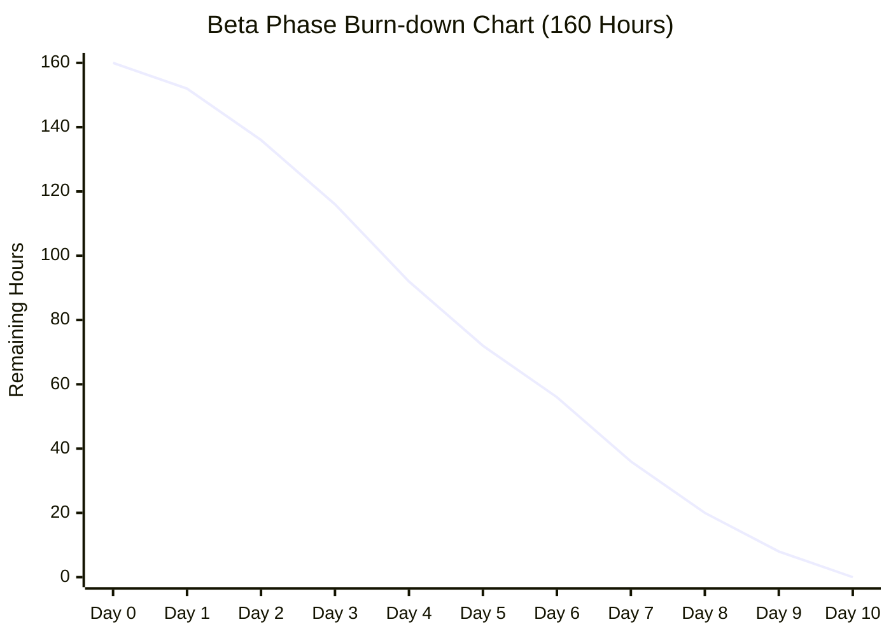

# FocusPet Beta 计划和估计

随着 Alpha 阶段的结束，FocusPet 项目正式进入 Beta 开发阶段。基于 Alpha 阶段的经验教训（Postmortem）以及用户反馈，我们制定了详细的 Beta 阶段计划。

## 1. 团队成员调整

在 Beta 阶段，我们的团队成员发生了变动：
- **申鹏** 离开项目组。
- **张沈晖** 加入项目组，接替申鹏的工作，主要负责 **React 前端 UI/交互、用户体验优化及前端联调**。

其他成员职责保持不变：
- **毛一戈**：后端核心、WebSocket、DB。
- **李永康**：Godot 端及原生集成。
- **赵昱**：Scrum Master、TimerService、CI/CD。

## 2. 功能规划 (Backlog)

根据 Postmortem 会议总结及用户反馈，我们在 Beta 阶段将聚焦于增强“游戏化”体验与核心功能的稳定性，同时移除部分高风险或低优先级的特性。

### Must-Haves (核心功能)
- **S1 (商店系统)**: 用户可以使用专注获得的“金币”在商店里给宠物购买“食物”或“装饰品”（如帽子、眼镜）。
- **S3 (心情系统)**: 宠物拥有“心情值”，需要用户通过“专注”或“喂食”来维持。心情值将直接影响宠物的动画表现。
- **UI 改进**: 引入仿 GitHub 贡献墙（Brick Wall）的统计视图，直观展示用户的专注历史。

### Could-Haves (进阶功能)
- **C3 (成就系统)**: 简单的成就系统（例如：累计专注 100 小时，累计完成 50 个任务），为用户提供长期激励。

### Won't-Haves (本阶段暂不实现)
- **C1 (分心检测)**: 涉及复杂的系统权限与隐私问题，且容易导致误判，暂不开发。
- **C2 (宠物进化)**: 资源需求过大（美术/动画），为保证核心体验质量，暂不开发。

## 3. 过程改进 (Process Improvements)

基于 Alpha Postmortem 的复盘，我们在项目管理和软件工程方面将进行以下改进：

### 项目管理
1. **提前规划发布流程**: 针对 Alpha 阶段遇到的 macOS 签名与打包瓶颈，我们将“跨平台打包与签名”作为高优先级任务提前启动，而非留到最后。
2. **明确验收标准 (Exit Criteria)**: 对每个功能点（尤其是“最后一公里”的交付件）设定明确的验收标准，确保发布质量。
3. **风险控制**: 减少过度工程化，聚焦于用户可感知的闭环体验（专注->奖励->消费），避免引入不必要的复杂技术栈。

### 软件工程
1. **自动化测试**: 引入关键路径（Timer、任务创建、统计）的自动化 E2E 测试，减少人工回归成本。
2. **后端兼容性**: 建立后端消息的版本兼容层，避免因数据结构变更导致的前端崩溃或统计错误。
3. **知识传递**: 针对新加入成员（张沈晖），安排 Pair Programming 和代码走查，确保前端工作的平滑交接。

## 4. 进度安排与燃尽图 (Burn-down)

Beta 阶段计划周期为 **2周 (10个工作日)**。

| Sprint | 时间 | 主要目标 | 关键交付物 |
|---|---|---|---|
| **Sprint 1** | Week 1 (Day 1-5) | 核心功能闭环 | 商店系统(后端+UI)、心情值逻辑与动画、GitHub 风格统计墙 |
| **Sprint 2** | Week 2 (Day 6-10) | 进阶功能与发布 | 成就系统、装饰品佩戴、自动化测试集成、最终打包发布 |

### 燃尽图 (Burn-down Chart)

*(以下为 Beta 阶段 10 天冲刺的预估燃尽数据。考虑到前期环境配置与新成员磨合，以及后期集成测试的复杂性，预计进度将呈现非线性变化)*

| Day | Remaining Hours | Notes (进度说明) |
|---|---|---|
| Day 0 | 160 | 计划启动 |
| Day 1 | 152 | 启动阶段，新成员环境配置与代码熟悉，进度较缓 |
| Day 2 | 136 | 进入开发状态，开始攻克核心 API 与 UI 框架 |
| Day 3 | 116 | **高效期**：商店与心情系统核心逻辑集中产出 |
| Day 4 | 92 | **Sprint 1 冲刺**：前后端联调，贡献墙 UI 完成 |
| Day 5 | 72 | Sprint 1 收尾，核心功能闭环，进行初步集成测试 |
| Day 6 | 56 | Sprint 2 启动，开始成就系统与装饰品开发 |
| Day 7 | 36 | **高效期**：进阶功能开发顺利，E2E 测试用例编写中 |
| Day 8 | 20 | 功能开发基本完成，进入密集 Bug 修复与打包验证 |
| Day 9 | 8 | **攻坚期**：解决跨平台签名与打包的最后阻碍 |
| Day 10 | 0 | 发布 Beta 版本 |

## 5. 详细任务分配 (Task Allocation)

为了确保在 10 天内高效交付，我们将任务详细分配到每位成员。
**注**：下述任务中的时间单位 **[X Days]** 指代该成员 **X 个工作日（即 4X 小时）** 的工作量。每位成员在两周内均分配了满额的 10 个工作日任务，总计 160 小时。

### 张沈晖 (前端 UI/交互)
*   **Week 1 (20h)**:
    *   [3 Days] **商店系统 UI**: 实现商品列表、购买确认弹窗、金币余额显示。
    *   [2 Days] **贡献墙 UI**: 基于 `react-activity-calendar` 或自研组件实现仿 GitHub 的专注热力图。
*   **Week 2 (20h)**:
    *   [2 Days] **成就系统 UI**: 展示成就列表、解锁状态及通知弹窗。
    *   [2 Days] **E2E 测试编写**: 配合 QA 编写前端关键路径 (Cypress/Playwright) 测试用例。
    *   [1 Day] **UI Polish**: 修复 UI 细节 Bug，优化动画流畅度。

### 毛一戈 (后端/架构)
*   **Week 1 (20h)**:
    *   [2 Days] **商店与经济系统 API**: 设计数据库表结构 (UserAssets, ShopItems)，实现购买、扣费接口。
    *   [1 Day] **统计 API 升级**: 聚合数据以支持前端“贡献墙”所需的热力图格式。
    *   [2 Days] **消息兼容层**: 重构 WebSocket 消息处理逻辑，建立版本控制中间件，防止前后端不一致导致崩溃。
*   **Week 2 (20h)**:
    *   [2 Days] **成就系统逻辑**: 实现成就触发器 (Trigger) 与状态持久化。
    *   [3 Days] **性能与稳定性**: 修复 Alpha 阶段遗留的 WebSocket 断连问题，协助排查集成 Bug。

### 李永康 (Godot/桌面集成)
*   **Week 1 (20h)**:
    *   [3 Days] **心情动画系统**: 实现宠物不同心情 (开心、普通、低落) 的状态机切换与动画资源绑定。
    *   [2 Days] **喂食交互**: 实现从前端接收“喂食”指令并在 Godot 端播放进食动画。
*   **Week 2 (20h)**:
    *   [3 Days] **装饰品挂载系统**: 实现宠物换装功能 (帽子、眼镜) 的骨骼挂载或图层叠加。
    *   [2 Days] **跨平台打包优化**: 解决 Godot 导出模版在不同 OS 下的路径兼容性问题。

### 赵昱 (Scrum Master/Timer/CI)
*   **Week 1 (20h)**:
    *   [3 Days] **跨平台签名 (Code Signing)**: 集中攻克 macOS 证书申请与 Notarization 流程，确保 Beta 版可正常安装。
    *   [2 Days] **CI 流水线升级**: 将 E2E 测试集成到 GitHub Actions，配置自动发版脚本。
*   **Week 2 (20h)**:
    *   [2 Days] **发布流程验证**: 在 Windows/macOS 虚拟机中反复验证安装包完整性。
    *   [3 Days] **项目管理与测试**: 主持每日站会，更新燃尽图，进行手动探索性测试 (Bug Bash)。

我们将在 Beta 阶段结束时交付一个功能完整、体验流畅且经过充分测试的 FocusPet 版本。