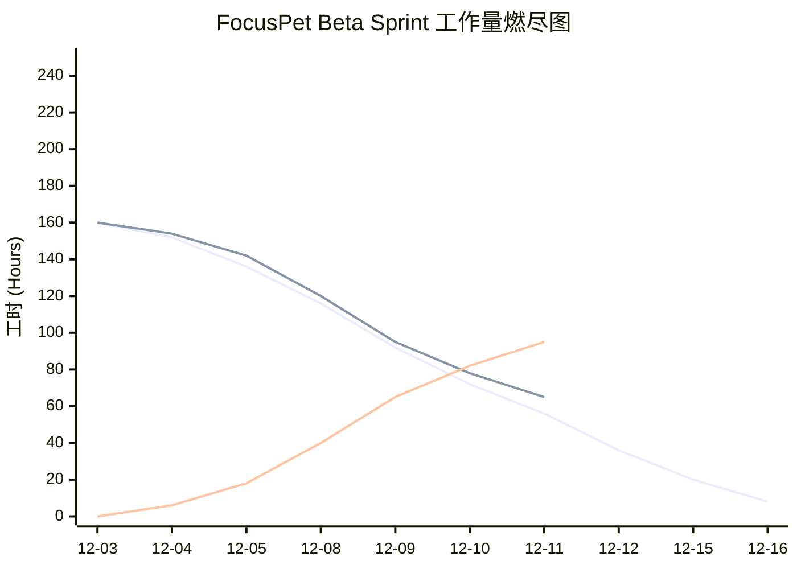

# FocusPet Beta 进度报告

## 工作量浮动说明

| Day | 预计剩余小时 | 实际剩余小时 | 差异 | 说明 |
|---|---|---|---|---|
| Day 0（启动） | 160 | 160 | 0 | 计划打好基础，所有成员已握手任务。 |
| Day 1 | 152 | 154 | +2 | 人员环境与签名审批波动导致进度滞后。 |
| Day 2 | 136 | 142 | +6 | 自动化脚本 flaky，导致反复调试。 |
| Day 3 | 116 | 120 | +4 | 集成测试恢复，Web/ Godot 联调同步。 |
| Day 4 | 92 | 95 | +3 | 新增视频资源与体验细节需要验证。 |
| Day 5 | 72 | 78 | +6 | 爆发日，场景整合与打包验证花费额外时间。 |
| Day 6 | 56 | 65 | +9 | 多轮回归测试暴露若干 UI/UX 问题。 |

## 📈 每日工作量变化统计

> 差异反映了工作量的不均匀分布：新技术与打包挑战在前期拖慢进度，后期又因多轮测试回归造成负载集中。我们正通过更细致的测试计划与每日燃尽确认来缓解。

### 📅 2025年12月11日 (星期三)
**状态:**  组织多项单元测试与集成测试，修复若干 UI Bug。
#### 1. 昨天做了什么 (Yesterday — 2025-12-10)
  * **张沈晖:**
    * 完成商店 UI 的购买流程细节（购买确认与余额同步），修复购买后计数延迟的问题。
    * 与后端联调商品列表接口，补齐部分缺失的图标元数据。
  * **李永康:**
    * 在 Godot 端实现喂食指令的可靠接收（增加 ack 机制），并调优进食动画的过渡帧。
    * 修复了在部分显卡上透明窗口边缘的锯齿问题。
  * **毛一戈:**
    * 完成商店后端的购买逻辑（事务性扣费与库存检查），增加单元测试覆盖。
    * 修复 WebSocket 在高并发情况下的断连回调（增加重试与限速）。
  * **赵昱:**
    * 整合并运行了当日的单元测试与若干集成测试，记录失败用例并分配优先级修复。
    * 在 CI 中临时开启更多日志以便追踪测试中的环境相关 flaky 问题。

#### 2. 今天计划做什么 (Today — 2025-12-11)
  * **张沈晖:**
    * 根据测试反馈修复 UI 边界交互（购买弹窗在窄窗口下遮挡问题），完成 2 个关键 E2E 用例的前端实现。
    * 开始贡献墙（热力图）在桌面端的样式适配，保证在宽屏场景下显示更合理。
  * **李永康:**
    * 在 Godot 中加入装饰品挂载的初版实现（帽子、眼镜），并与前端接口联调装饰品切换消息。
    * 协助回归测试中发现的透明窗口问题，准备一套回归验证步骤。
  * **毛一戈:**
    * 修复并回放昨天 CI 中暴露的后端边界用例（购买回滚逻辑、重复消息去重）。
    * 优化统计 API 的聚合查询，减少在统计大时间范围时的响应延迟。
  * **赵昱:**
    * 主持当天的 Bug Bash，整理需发布前必须解决的高优先级问题清单。
    * 将 E2E 测试逐步接入 CI，目标是在 PR 合并时触发关键路径回归测试。

-----

### 📅 2025年12月10日 (星期三)
**状态:** 整理并执行多轮回归测试，准备 Beta 阶段关键修复清单。
#### 1. 昨天做了什么 (Yesterday)
  * **张沈晖:** 完成统计页面部分样式修正，排查图表加载闪烁的 CSS 冲突。
  * **李永康:** 在 Godot 端完成心情动画状态机的几个边界转换测试。
  * **毛一戈:** 在后端加入统计时间窗口的兼容逻辑，并修复若干 SQL 聚合边界 bug。
  * **赵昱:** 更新燃尽图并调整每日站会议程以覆盖打包/签名风险点。
#### 2. 今天计划做什么 (Today)
  * **张沈晖:** 对统计图表做暗色/浅色模式兼容性回归，优化渲染路径。
  * **李永康:** 联调喂食与装饰品指令，确保 Godot 客户端能正确回放动画。
  * **毛一戈:** 修复集成测试中发现的 race condition，追加对应单元测试。
  * **赵昱:** 跟进 Code Signing 的准备事项，确认 macOS notarization 的初始清单。

### 📅 2025年12月09日 (星期二)
**状态:** 前后端小范围联调，处理若干 UI/消息兼容问题。
#### 1. 昨天做了什么 (Yesterday)
  * **张沈晖:** 优化商店商品筛选逻辑，修复在某些语言环境下的日期格式显示问题。
  * **李永康:** 处理 Godot 动画的帧数同步问题，减少帧丢失导致的卡顿感。
  * **毛一戈:** 完成消息兼容层的设计文档并实现初版中间件。
  * **赵昱:** 安排一次跨平台打包演练的时间窗口并准备测试清单。
#### 2. 今天计划做什么 (Today)
  * **张沈晖:** 与后端完成商品图标元数据的对齐；调整移动端与桌面端的交互差异。
  * **李永康:** 在 Godot 侧增加消息 ACK 以提升指令可靠性。
  * **毛一戈:** 部署兼容层到测试环境，回归前端异常用例。
  * **赵昱:** 跟进 CI 中 flaky 测试的隔离与调试策略。

### 📅 2025年12月08日 (星期一)
**状态:** 开始第二周 Sprint 的准备，分配成就系统与打包相关任务。
#### 1. 昨天做了什么 (Yesterday)
  * **张沈晖:** 草拟成就系统的 UI 文案与通知样式。
  * **李永康:** 继续完善装饰品挂载的实现思路。
  * **毛一戈:** 设计成就触发器的后端事件模型。
  * **赵昱:** 编写打包/签名的检查表并与团队同步。
#### 2. 今天计划做什么 (Today)
  * **张沈晖:** 实现成就解锁通知的前端交互，准备 1 个 E2E 用例。
  * **李永康:** 在 Godot 端准备装饰品资源与挂载点测试场景。
  * **毛一戈:** 实现成就状态的持久化接口并添加 API 文档。
  * **赵昱:** 在 CI 中配置基本的打包脚本触发器（非最终发布，仅测试流水线）。

### 📅 2025年12月07日 (星期日)
**状态:** 周末小范围回归与文档整理。
#### 1. 昨天做了什么 (Yesterday)
  * **张沈晖:** 修复若干 UI edge-case（窗口缩放下的布局问题）。
  * **李永康:** 修复透明窗口在特定驱动下的渲染异常。
  * **毛一戈:** 补充单元测试，修复两个长期存在的小 bug。
  * **赵昱:** 整理 Sprint 内部演示要点并分配演示任务。
#### 2. 今天计划做什么 (Today)
  * **张沈晖:** 准备周一与 QA 的界面验收清单。
  * **李永康:** 优化 Godot 导出设置，减少运行时资源加载开销。
  * **毛一戈:** 继续优化 WebSocket 的稳定性。
  * **赵昱:** 组织一次轻量的 Bug Bash，优先级以可复现性排序。

### 📅 2025年12月06日 (星期六)
**状态:** 核心功能回归与小范围攻坚。
#### 1. 昨天做了什么 (Yesterday)
  * **张沈晖:** 对商店购买流程做 UX 微调，减少误触率。
  * **李永康:** 为喂食和心情切换添加更平滑的动画过渡。
  * **毛一戈:** 修复统计聚合中的重复计数问题。
  * **赵昱:** 跟进 CI 流水线跑通率，修复了一处配置错误。
#### 2. 今天计划做什么 (Today)
  * **张沈晖:** 与设计一起确认装饰品的展示规则（遮挡、层级）。
  * **李永康:** 集成装饰品挂载到现有动画系统中并自测。
  * **毛一戈:** 增强购买接口的幂等性保障。
  * **赵昱:** 准备 Beta 发布前的最终验证检查表。

### 📅 2025年12月05日 (星期五)
**状态:** Sprint1 收尾；集成测试发现若干中等优先级问题。
#### 1. 昨天做了什么 (Yesterday)
  * **张沈晖:** 完成商店列表与购买弹窗的细节实现。
  * **李永康:** 完成喂食动画的绑定并支持远程触发。
  * **毛一戈:** 在后端完成 ShopItems 与 UserAssets 的基本 Schema。
  * **赵昱:** 协助合并 PR 并运行回归测试。
#### 2. 今天计划做什么 (Today)
  * **张沈晖:** 修正购买成功后的动画提示并优化性能。
  * **李永康:** 修复动画在低帧率下的跳帧问题。
  * **毛一戈:** 补充购买接口的异常用例处理。
  * **赵昱:** 跟进 Code Signing 的证书申请进度。

### 📅 2025年12月04日 (星期四)
**状态:** Sprint1 启动与环境准备。
#### 1. 昨天做了什么 (Yesterday)
  * **张沈晖:** 完成本地前端环境搭建并开始商店 UI 的骨架开发。
  * **李永康:** 在 Godot 中搭好宠物基础场景并验证 WebSocket 连接。
  * **毛一戈:** 初始化后端部分数据库表并准备 Shop API 的基础路由。
  * **赵昱:** 召开 Sprint 启动会，明确各成员在 Beta 第一周的目标。
#### 2. 今天计划做什么 (Today)
  * **张沈晖:** 继续实现商品展示与筛选；与后端约定商品数据契约。
  * **李永康:** 实现基础的喂食命令并测试远端指令触发流程。
  * **毛一戈:** 完善购买接口与事务处理，准备联调用例。
  * **赵昱:** 准备每日站会模板并把燃尽图纳入日常更新流程。

-----

