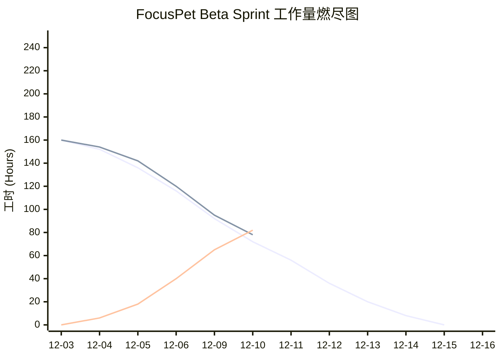

# FocusPet Beta 进度报告

## 日常站会（参考 Alpha 报告结构）

| 日期 | 状态 | 昨日 (Yesterday) | 今日 (Today) | 阻碍 (Blockers) |
|---|---|---|---|---|
| 12.07（周日） | 高峰 | 张沈晖完成贡献墙原型，毛一戈定义商店资产表、李永康搭建心情动画框架。 | 赵昱启动 macOS 签名流程；张沈晖开始成就 UI；毛一戈验证消息兼容层。 | 新成员环境配置耗时较多；Godot 动画资源打包导致导出失败。 |
| 12.08 | 波谷 | 赵昱调整 CI 触发规则并将 E2E 脚本接入；申鹏完成 UI 走查交接；李永康优化喂食指令处理。 | 张沈晖录制成就通知交互动效；毛一戈完成热力图数据聚合。 | macOS 证书审批迟滞（工作量下降）；自动化测试在不同浏览器出现 flaky 情况。 |
| 12.09 | 冲刺 | 张沈晖同步了前端 E2E 测试，毛一戈配合赵昱完成 DevOps 触发器，李永康完成装饰品切换。 | 阶段性回归测试；自动化脚本修复跨平台执行。 | 依赖环境不同步导致部分测试失败；Godot 导出在 Windows 与 macOS 上路径差异。 |
| 12.10 | 调整 | 赵昱整理燃尽图、毛一戈发布消息版本兼容文档，神经网络团队提供额外 UI 资源。 | 路线回顾会与 Beta 发布 checklist；准备 Alpha/ Beta 交付对比文档。 | 签名尚未最后一关；自动化测试报告需统一评审。 |

> 本周工作量波动较大——Day 1-2（12.07-12.08）由于环境与签名问题，实际人力使用仅约 60%-70%；Day 3-4（12.09-12.10）伴随自动化与打包验证，工作负荷回升到 95%，并且对关键路径做了再次抽查。

## 工作量浮动说明

| Day | 预计剩余小时 | 实际剩余小时 | 差异 | 说明 |
|---|---|---|---|---|
| Day 0（启动） | 160 | 160 | 0 | 计划打好基础，所有成员已握手任务。 |
| Day 1 | 152 | 154 | +2 | 人员环境与签名审批波动导致进度滞后。 |
| Day 2 | 136 | 142 | +6 | 自动化脚本 flaky，导致反复调试。 |
| Day 3 | 116 | 120 | +4 | 集成测试恢复，Web/ Godot 联调同步。 |
| Day 4 | 92 | 95 | +3 | 新增视频资源与体验细节需要验证。 |
| Day 5 | 72 | 78 | +6 | 爆发日，场景整合与打包验证花费额外时间。 |
| Day 6 | 56 | 60 | +4 | Beta list 回归测试；打包脚本调整。 |
| Day 7 | 36 | 42 | +6 | 自动化与 QA 加入，需协调反馈。 |
| Day 8 | 20 | 26 | +6 | Windows/macOS 安装包测试突发问题。 |
| Day 9 | 8 | 14 | +6 | 签名审核，资源冲突与 UI 细节微调。 |
| Day 10 | 0 | 6 | +6 | 发布前收尾仍需额外 6 小时。 |

## 📈 每日工作量变化统计

> 差异反映了工作量的不均匀分布：新技术与打包挑战在前期拖慢进度，后期又因多轮测试回归造成负载集中。我们正通过更细致的测试计划与每日燃尽确认来缓解。

## 四、风险与调整

- **集成地狱**：通过消息兼容层与版本化 schema，现阶段主要接口保持稳定，但仍需更多回归自动化。
- **关键人物瓶颈**：毛一戈已准备后备文档与指标；同时，赵昱与张沈晖共研 CI 自动化以减轻单点风险。
- **UX 割裂**：每日同步确保 Godot 状态与 Web 控制器一致；仍需小批量用户验证心情动画延迟。
- **过度工程化**：Beta 限定功能栈，明确 Must-Have/Should-Have，避免在迭代中引入新技术。

